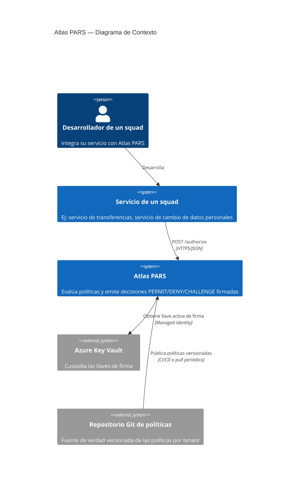
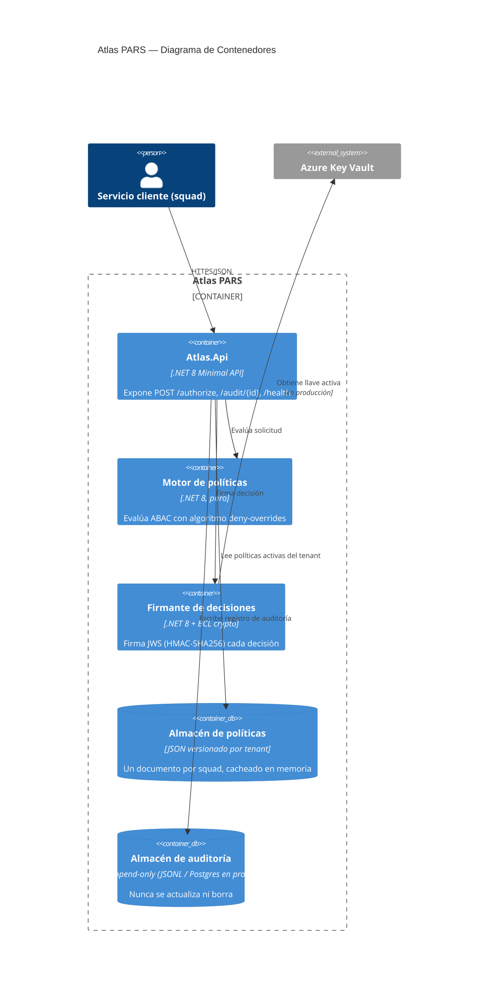
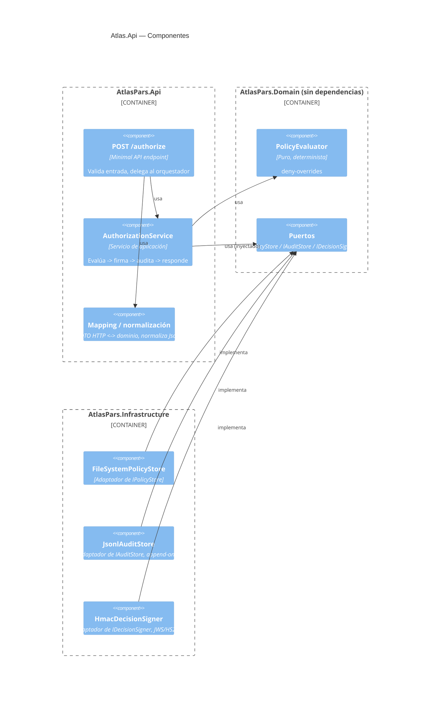
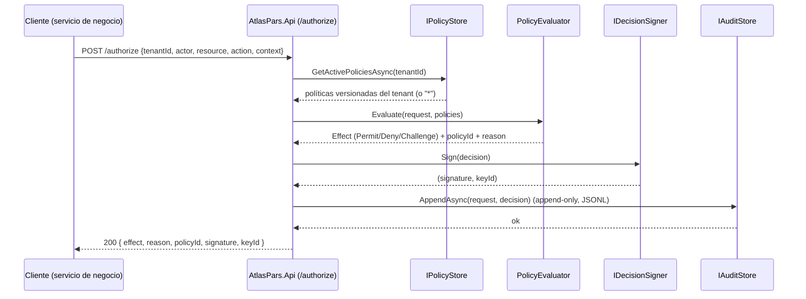

# Arquitectura — Atlas PARS (Policy Access to Sensitive Resources)

## Nivel 1 — Contexto

Atlas PARS es un servicio de plataforma: cualquier squad lo consume para autorizar operaciones
críticas sin reimplementar lógica ABAC, firma criptográfica de decisiones o auditoría.

## Nivel 2 — Contenedores

## Nivel 3 — Componentes (Api)

## Flujo de autorización (secuencia)

Puntos clave del flujo: la decisión se firma **antes** de auditar y responder (para que la firma
cubra exactamente lo que se persiste y se devuelve), y el aislamiento de tenant se aplica dos
veces — al pedir las políticas (`GetActivePoliciesAsync(tenantId)`) y de nuevo como guard
defensivo dentro de `AuthorizationService` (ver ADR-0003).

## Por qué arquitectura hexagonal (puertos y adaptadores)

El dominio (`AtlasPars.Domain`) no tiene **ninguna** dependencia externa — ni de ASP.NET, ni de
System.Text.Json a nivel de tipos, ni de ningún proveedor de nube. Esto es deliberado:

1. **Testeable sin infraestructura**: `PolicyEvaluator` es una función pura (mismo input, mismo
   output, sin I/O), lo que permite testear miles de combinaciones de políticas en milisegundos.
2. **Reemplazable**: cambiar de archivos JSON a Postgres para políticas, o de HMAC a RS256 para
   firma, no toca una sola línea del dominio — solo se escribe un nuevo adaptador.
3. **Verificable bajo carga concurrente**: al no haber estado mutable compartido en el motor de
   evaluación, razonar sobre concurrencia (requisito: alta concurrencia, P95 < 150ms) es mucho
   más simple.

## Qué NO se construyó (alcance recortado, ver también BACKLOG.md)

- No hay una capa "Application" separada de la Api: para un solo caso de uso real, esa
  indirección no aportaba valor en el tiempo disponible (ver ADR-0001).
- No hay motor Rego/OPA embebido: se implementó un DSL JSON propio, más simple de razonar para
  este alcance (ver ADR-0001).
- Persistencia de auditoría es JSONL append-only en disco, no Postgres/EventStoreDB real (ver
  ADR-0003) — el contrato `IAuditStore` sí está listo para ese reemplazo.
- No se implementó UI de administración de políticas (fuera de alcance, "Frontend no se evalúa").
